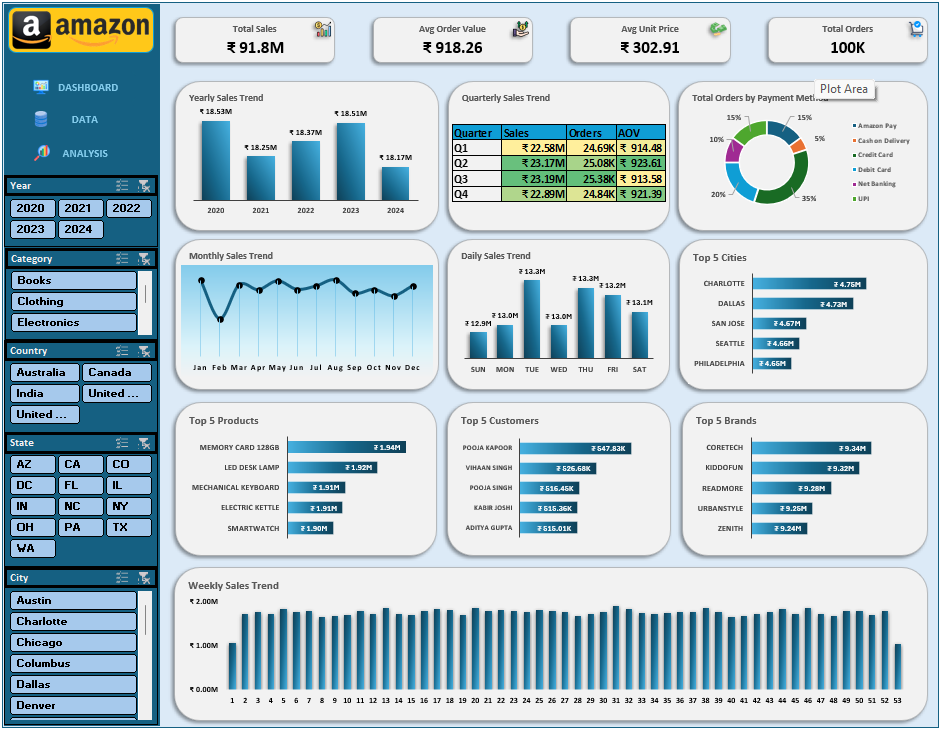

# 📦 Amazon Sales Analytics (Excel Project)

This repository presents an **Excel-based analytics project** analyzing the sales performance of **Amazon**, one of the world’s largest e-commerce platforms.

The project simulates a real‑world business case where Amazon’s management seeks actionable insights into order trends, revenue growth, and product performance using an interactive Excel dashboard.

---

## 🎯 Project Objective

The objective of this project is to help **Amazon management**:

- Gain visibility into overall sales performance across time periods and categories  
- Identify top‑performing and underperforming products  
- Provide **executive-level KPIs** for quick decision-making  
- Enable **interactive exploration** of order and revenue data using Excel features  
- Build a scalable **Excel reporting framework** for future analytics initiatives  

---

## 🛠️ Tech Stack

- **Microsoft Excel** – Dashboard creation, pivot tables, charts, slicers, conditional formatting  
- **Formulas & Functions** – SUMIFS, XLOOKUP, INDEX-MATCH, IF statements, etc.  
- **Data Modeling** – Structured tables, relationships, calculated fields  
- **Git & GitHub** – Version control and collaboration  

---

## 📂 Repository Contents

- **Excel Dashboard File (`.xlsx`)**  
- **Dashboard Screenshot**  
- **Project Notes & Methodology**  

---

## 📑 Report Screenshot

### 📊 Amazon Sales Dashboard
Interactive Excel dashboard summarizing key KPIs such as total orders, revenue, category performance, and product trends.  

---

## 📘 Learnings

- Building a **scalable Excel reporting framework** integrating multiple datasets  
- Designing **executive-friendly dashboards** with clear KPIs using pivot tables and charts  
- Applying **advanced Excel formulas** (SUMIFS, XLOOKUP, INDEX-MATCH) for dynamic calculations  
- Using **slicers and conditional formatting** to enable interactive exploration  
- Understanding **sales analytics** (customer demand, product performance, revenue trends)  
- Applying **Excel dashboard design principles** such as consistent color palettes, intuitive layouts, minimal clutter, and clear storytelling to make dashboards more engaging and decision‑friendly  

---

## 🏆 Project Outcome

The **Amazon Sales Analytics Excel dashboard** revealed key insights into sales performance:

- **Overall Sales Trends:** Identified revenue growth patterns and highlighted months with significant dips due to demand fluctuations.  
- **Product Analysis:** Revealed top-performing categories and SKUs, while also identifying underperforming products that require marketing or inventory adjustments.  
- **Customer Insights:** Showed contribution of repeat customers and highlighted retention opportunities.  
- **Revenue Drivers:** Pinpointed categories and time periods driving revenue growth.  

✅ In summary, the dashboard provides **actionable visibility into Amazon’s sales performance by product, category, and time period**, enabling management to **optimize product portfolios, strengthen customer retention, and drive sustainable growth**.

---

## 👨‍💻 Author

Developed by **Prashant**  
Passionate about **data analytics, visualization, and business intelligence**.  
